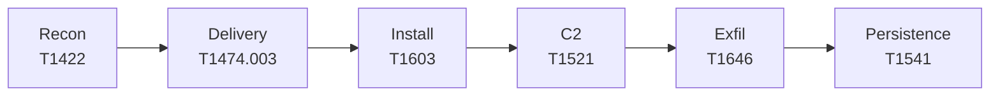

# Cyber Kill Chain & ATT&CK Mapping

All techniques are implemented with **self-built, benign proof-of-concept code** executed in an isolated emulator against a test server under my control. No in-the-wild malware is used, and nothing is ever run on a personal device.

## Kill-chain flow

## Technique mapping (ATT&CK Mobile matrix v19)

| Kill Chain Phase | Technique | Implementation |
|---|---|---|
| Reconnaissance | System Network Configuration Discovery — [T1422](https://attack.mitre.org/techniques/T1422/) | App calls `ConnectivityManager` / `WifiManager` APIs |
| Weaponization / Delivery | Supply Chain Compromise — [T1474.003](https://attack.mitre.org/techniques/T1474/003/) | PoC payload bundled into a benign-looking utility APK, sideloaded in emulator |
| Exploitation / Installation | Scheduled Task/Job — [T1603](https://attack.mitre.org/techniques/T1603/) | `WorkManager` / `AlarmManager` schedules payload execution |
| Command and Control | Encrypted Channel — [T1521](https://attack.mitre.org/techniques/T1521/) | TLS socket from PoC app to my own test server |
| Actions on Objectives | Exfiltration Over C2 Channel — [T1646](https://attack.mitre.org/techniques/T1646/) | Reuse the TLS socket to send a dummy "sensitive" file |
| Bonus (Defense Evasion / Persistence) | Foreground Persistence — [T1541](https://attack.mitre.org/techniques/T1541/) | Foreground service abuse; easy to demo and detect |

Visualize the selected techniques on the [ATT&CK Navigator](https://mitre-attack.github.io/attack-navigator/) Mobile matrix for the report.
