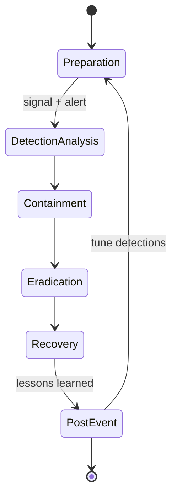

# Incident Response

IR lifecycle for the detection demo, explicitly labeled at each stage.

## Preparation

- Isolated emulator / wiped burner device, sandboxed network.
- Baseline of clean device state, SOC dashboard live, logging in place.

## Detection & Analysis

- Agent correlates on-device signals against ATT&CK techniques and raises alerts.
- Evidence: `logcat`, `adb shell dumpsys jobscheduler`, Wireshark capture of the TLS session, exfil timestamp.

## Containment, Eradication & Recovery

- Kill the scheduled job.
- Revoke network access.
- Remove the PoC app; restore clean baseline.
- (Containment actions are scripted/manual, then documented by the agent.)

## Post-Event Activity

- Agent generates the IR report; lessons learned; detection tuning.

## Next steps

- [ ] Build containment scripts (kill scheduled job, revoke network access).
