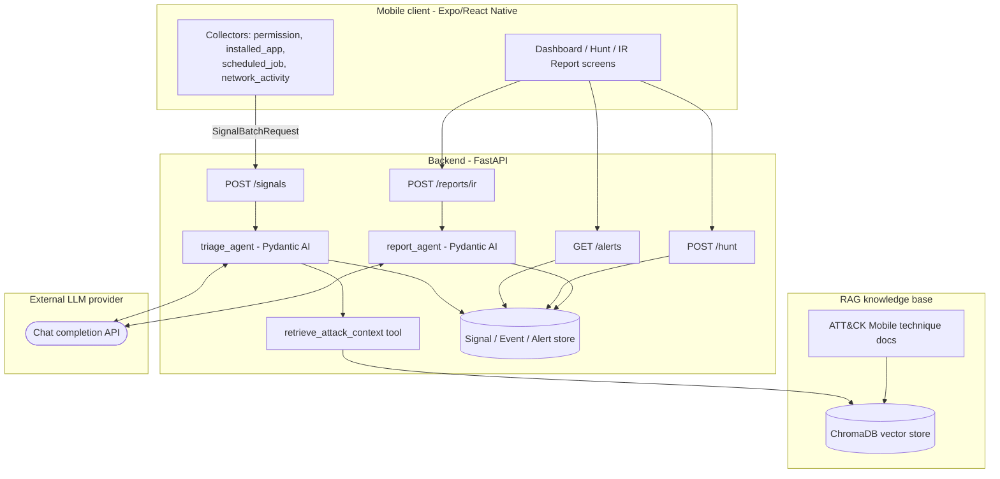
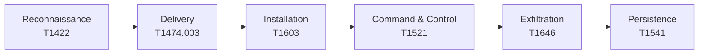

# Research Report

*Mobile AI SOC Analyst: An LLM-Agent Approach to Detecting Threats, APTs,
Backdoors, Malware, and Spyware on Android/iOS*

CYT230 — Project 2, Part 3 (Individual Research Report)

---

## Abstract

Mobile devices now carry the same volume of sensitive personal, financial,
and organisational data as traditional endpoints, yet they remain
comparatively under-monitored: consumer mobile operating systems expose no
equivalent of an EDR agent, and the telemetry a Security Operations Centre
(SOC) would normally rely on — process trees, registry writes, network
flow metadata correlated to a running process — is either unavailable or
heavily sandboxed by design on Android and iOS. At the same time, the
threat surface has matured past opportunistic adware into commercial
spyware, stalkerware, and mobile components of nation-state and
financially motivated advanced persistent threat (APT) campaigns [5, 6].
This report investigates whether a large-language-model (LLM) agent,
grounded in a retrieval-augmented generation (RAG) knowledge base of the
MITRE ATT&CK for Mobile matrix, can perform credible Tier-1 SOC analyst
work — triage, technique correlation, and incident-response reporting —
over the limited signal surface a consumer mobile client can legitimately
collect without native instrumentation or elevated permissions.

The work is grounded in a self-built system: an Expo/React Native mobile
client that collects on-device signals and posts them to a FastAPI
backend, where a Pydantic AI agent classifies each signal as benign or
suspicious, correlates suspicious signals to a real ATT&CK Mobile
technique ID via a RAG lookup over a ChromaDB vector store, and persists
the resulting alert with a full audit trail. A second agent generates
incident-response reports across the four IR lifecycle stages defined in
NIST SP 800-61 Rev. 2 [12], grounded in the specific alert's data and the
project's own containment tooling — not templated boilerplate. Detection
is validated experimentally against a self-built, benign proof-of-concept
Android application that implements a six-step attack chain (network
reconnaissance, supply-chain-style delivery, scheduled-job persistence,
encrypted command-and-control, exfiltration, and foreground-service
persistence), each step mapped to a specific ATT&CK Mobile technique ID
and executed only in an isolated lab environment against infrastructure
under the author's control — no in-the-wild malware sample is used
anywhere in this work, consistent with course guidance and with standard
safe-research practice for malware-adjacent coursework.

The report frames the agent explicitly as a **Tier-1 SOC analyst**: it
performs first-pass triage, correlation, and report drafting, while
containment actions, threat-hunting hypotheses, and final incident
disposition remain a human (Tier-2/3) analyst's responsibility — mirroring
how AI copilots are actually deployed in production SOCs today [7, 8],
rather than proposing full autonomous response, which the literature and
this project's own threat model both treat as inappropriate for a system
whose only "ground truth" is an LLM's own judgement.

---

## Table of contents

1. Introduction
2. Problem statement
3. Threat
4. Risk
5. Mitigating controls
6. Detection
7. Protection
8. Lab experiment
9. Conclusion
10. References

---

## 1. Introduction

Smartphones are the primary computing device for most users worldwide,
and the primary attack surface for a large and growing share of consumer-
and enterprise-targeted intrusions. Unlike the desktop/server world, where
decades of EDR/XDR tooling assume kernel-level or near-kernel visibility,
mobile operating systems are architected around app sandboxing and
permission brokering specifically to *deny* that level of visibility to
any single app — including a legitimate defensive one. A mobile "SOC
analyst" app, therefore, cannot simply port a desktop detection
architecture down to a phone; it has to work within a narrower, permission-
gated signal surface (granted permissions, installed application
inventory, scheduled background jobs, and network activity metadata) and
still produce analyst-grade output: a triaged, technique-mapped alert with
a defensible rationale, not just a raw event log.

Large language models offer a plausible way to close that gap on the
*analysis* side even where the *collection* side remains constrained: an
LLM agent can reason over a short, structured signal description the way
a junior analyst would — "does this pattern look like reconnaissance,
persistence, or C2 behaviour?" — provided it is grounded in an
authoritative technique taxonomy rather than left to answer from
pretrained knowledge alone, which risks both hallucinated technique IDs
and stale threat framing. Recent survey literature on LLMs in SOC contexts
confirms this is an active, credible research direction rather than a
novelty: LLMs are increasingly used for alert triage, technique mapping
against MITRE ATT&CK, and report drafting, with the strongest results
coming from architectures that pair the model with retrieval over
authoritative sources rather than relying on the model's parametric
knowledge alone [7, 8].

This project implements exactly that architecture, end to end, and
evaluates it against a self-built, ATT&CK-mapped attack chain rather than
a synthetic or purely textual benchmark — a design choice intended to keep
the evaluation honest: every alert the system raises during the lab
experiment (Section 8) corresponds to a concrete, reproducible action
taken by real code running on a real (emulated) Android device, not a
hand-crafted prompt engineered to look convincing.

## 2. Problem statement

**How can a mobile client, constrained to the on-device signals a
consumer OS will legitimately expose to an unprivileged app, support
Tier-1 SOC analyst functions — triage, ATT&CK-technique correlation, and
incident-response report generation — with enough fidelity to be useful to
a human analyst, while avoiding the two failure modes most associated
with LLM-based security tooling: hallucinated technique attribution, and
over-trust in an autonomous system whose reasoning is not independently
verifiable per-alert?**

This decomposes into three sub-problems addressed by this project:

1. **Signal scope.** Which on-device signals are both collectible without
   native/elevated tooling on a stock consumer device *and* diagnostic of
   the attack techniques most associated with mobile malware, spyware, and
   APT tradecraft? (Addressed in Sections 3–4, and reflected in the
   project's `permission`, `installed_app`, `scheduled_job`, and
   `network_activity` signal taxonomy — see
   [Functional Requirements](../product/functional-requirements.md)
   FR-001.)
2. **Grounded correlation.** How can an LLM agent be constrained so that
   every ATT&CK technique ID it cites in an alert is a real technique
   actually retrieved from an authoritative source for that specific
   signal, rather than a plausible-sounding invention? (Addressed in
   Section 6, via the RAG architecture.)
3. **Appropriate autonomy boundary.** Which SOC functions is it
   appropriate to delegate to the agent (triage, correlation, first-draft
   reporting), and which must remain human-driven (containment execution,
   hunt hypothesis formation, final incident closure)? (Addressed in
   Sections 5–6, and reflected directly in the system's role split between
   the agent and the analyst.)

## 3. Threat

### 3.1 Threat landscape

Mobile-targeting threats span a spectrum from commodity adware through to
sophisticated, often commercially developed surveillance tooling:

- **Malware and trojans.** Android malware research has matured
  considerably since early static-analysis systems such as DREBIN, which
  demonstrated that broad static feature extraction (permissions, API
  calls, intent filters) combined with a lightweight classifier could
  detect 94% of malware in a 123,453-app corpus with a low false-positive
  rate [1]. More recent work has moved toward deep-learning classifiers —
  convolutional architectures trained on the same class of static feature
  sets report accuracy above 99% on benchmark datasets such as Drebin-215
  [3], and recent surveys catalogue a broad shift toward deep learning as
  the dominant paradigm in the field, while also noting the field's
  continuing struggle with concept drift as malware authors adapt to
  known detection features [2].
- **Spyware and stalkerware.** A distinct and growing category —
  applications installed (often by an abusive partner, employer, or state
  actor rather than the device owner acting maliciously against
  themselves) specifically to covertly monitor communications, location,
  and media. Empirical detection work here reports meaningfully lower
  accuracy than mainstream malware detection (69–94% depending on the
  specific spyware family, in binary vs. multi-class settings) [4],
  reflecting how deliberately these tools are engineered to mimic
  legitimate app behaviour and evade both automated and manual review. A
  2025 review of the broader "surveillanceware" category — spanning
  consumer stalkerware through to mercenary, nation-state-grade spyware —
  concludes that current OS-level protections are frequently bypassed via
  risky user behaviour or software flaws, and explicitly calls for future
  detection research to lean more heavily on AI, including LLM-based
  approaches, to keep pace [5]. A dedicated survey of Android stalkerware
  detection techniques specifically reinforces that this sub-category
  requires detection approaches distinct from mainstream malware
  classification, since stalkerware is frequently a legitimate-seeming,
  sideloaded monitoring tool rather than an app attempting to disguise
  malicious *code* [6].
- **Advanced Persistent Threats (APTs) with mobile components.** Nation-
  state and highly resourced threat actors increasingly incorporate mobile
  compromise into broader campaigns — including campaigns targeting
  democratic institutions and processes, as documented in the Canadian
  Centre for Cyber Security's 2025 report on cyber threats to Canada's
  democratic process, which identifies mobile device compromise as one
  vector among a broader influence-operations and espionage toolkit
  deployed against public-sector and civil-society targets [14]. APT
  mobile tradecraft characteristically favours the same technique classes
  this project targets — reconnaissance of device/network configuration,
  supply-chain-style delivery via a trojanised or sideloaded app, scheduled
  persistence, and encrypted C2 with data exfiltration — precisely because
  these are the techniques an APT can execute without requiring an
  unpatched zero-day, making them both more common in practice and a
  reasonable, representative target for a detection-focused project of
  this scope.
- **Backdoors.** Functionally, a backdoor on mobile is most often realised
  through the same primitives as the above: a scheduled or foreground-
  persistent component that maintains a covert communication channel to an
  attacker-controlled endpoint, which is exactly the T1603/T1521/T1646/
  T1541 chain implemented and detected in this project (Section 8).

### 3.2 Why detection is hard on mobile specifically

Three structural properties of mobile OSes make Tier-1 triage
meaningfully harder than the desktop/server equivalent:

1. **No first-class process-behaviour telemetry for third-party apps.**
   A defensive app cannot observe another app's syscalls, memory, or
   network sockets directly; it can only observe what the OS is willing to
   expose through public APIs (e.g. `ConnectivityManager`/`WifiManager`
   for network state), which is exactly why this project's own
   `network_activity` collector is scoped the way it is — see
   [engineering/system-design.md](../engineering/system-design.md).
2. **Permission-gated collection creates an intrinsic scope/coverage
   trade-off.** Broader signal coverage (installed-app inventory,
   scheduled-job enumeration) typically requires either elevated
   permissions the user must explicitly grant, or platform APIs that
   themselves vary in availability across OS versions — meaning a mobile
   SOC client's signal coverage is inherently narrower and more
   version-fragile than a desktop EDR's.
3. **Base-rate and false-positive pressure.** Because the *legitimate* use
   of scheduling APIs (`WorkManager`/`AlarmManager`/`JobScheduler`),
   network sockets, and foreground services is extremely common in benign
   apps, a naive rule-based detector over these primitives alone would
   generate prohibitive false-positive volume — motivating this project's
   use of an LLM agent to reason over the *combination and context* of
   signal attributes (e.g. job interval + reboot persistence, per the
   `poc_recon_job` example in Section 8) rather than a single boolean
   feature.

## 4. Risk

Risk here is analysed along two axes: the risk the threats in Section 3
pose to a device owner/organisation, and the risk profile of the
detection system itself (since an LLM-based SOC tool introduces failure
modes a traditional rule engine does not).

### 4.1 Risk to the monitored asset

| Risk | Likelihood | Impact | Notes |
|---|---|---|---|
| Covert data exfiltration (contacts, location, messages) via spyware/stalkerware | Medium–High for targeted individuals; lower for opportunistic malware | High (privacy, safety — stalkerware specifically implies a real-world physical-safety risk to the victim) | [4], [5], [6] |
| Device used as a persistent C2 beacon / backdoor | Medium | High (confidentiality, and potential lateral use of the device as an access point into other accounts/services) | Matches T1521/T1646 in this project's kill chain |
| Supply-chain compromise via a trojanised utility app | Medium | High (initial-access foothold for any of the above) | T1474.003; matches this project's PoC delivery vector |
| APT targeting of high-value individuals (journalists, officials, activists) | Low in absolute terms, but concentrated and high-consequence | Very high | [14] |

### 4.2 Risk introduced by the detection system itself

An LLM agent used for security triage is not risk-free relative to a
traditional rule engine, and this project's threat model treats the
detection pipeline itself as an asset requiring protection (see
[Threat Model](../security/threat-model.md)):

- **Hallucinated technique attribution.** An ungrounded LLM can cite a
  plausible-sounding but nonexistent or wrong ATT&CK ID. This is the
  single risk this project's architecture is most explicitly designed
  against — see Section 6.
- **Repudiation / audit risk.** If an alert cannot be traced back to the
  exact signal, verdict, confidence, and technique correlation that
  produced it, the analyst cannot trust or challenge it after the fact.
  Mitigated by full Signal→Event→Alert persistence (FR-009).
- **Third-party data exposure.** Sending on-device signal data to an
  external LLM API (OpenAI, in this implementation) is itself a
  disclosure risk that must be minimised — only the fields needed for
  triage are sent, not raw device state.
- **Over-trust / automation bias.** The most consequential risk of any
  AI-assisted SOC tool is an analyst treating agent output as a final
  verdict rather than a first-pass recommendation — the literature on
  LLMs in SOC contexts identifies this as a first-order concern for
  production deployment, not a hypothetical one [7, 8], which is why this
  project deliberately keeps containment execution and hunt-hypothesis
  formation outside the agent's authority (Section 6.3).

## 5. Mitigating controls

Controls are grouped by the OWASP MASVS/MASTG control domains they map to
[10], with the corresponding OWASP Mobile Top 10 (2024) risk category
noted where applicable [11]:

| Control | MASVS / Mobile Top 10 mapping | Implementation in this project |
|---|---|---|
| Transport-layer encryption for all client↔backend traffic | MASVS-NETWORK / M5 Insecure Communication | Shared-key bearer auth over TLS to the backend (see [security-model.md](../security/security-model.md)) |
| Authenticated, authorised backend API | M1 Improper Credential Usage | `require_api_key` dependency on every backend route; explicit 401 surfaced distinctly from generic network failure |
| On-device data minimisation | MASVS-STORAGE / M2 Inadequate Supply Chain & Data Protection | Collectors emit only the normalized fields needed for triage, not raw device state |
| Secrets management | M1 | API keys via environment/secret store (Azure Key Vault / Container App secrets), never committed to source |
| Full audit trail of every alert | — (supports non-repudiation, NIST SP 800-61 evidence-handling guidance [12]) | Signal → Event → Alert chain persisted with technique mapping and timestamps (FR-009) |
| Grounded (non-hallucinating) technique attribution | — (mitigates the LLM-specific risk in §4.2) | RAG-constrained agent tool call — see Section 6 |
| Supply-chain awareness of the delivery vector | M8 Security Misconfiguration / supply-chain compromise | Detection pipeline specifically targets sideloaded-utility-app delivery (T1474.003) as a first-class detection target, not an afterthought |
| Malware-incident handling procedure | NIST SP 800-83 [13] | This project's IR report structure and containment scripts follow the prevention/handling lifecycle NIST 800-83 defines for desktop/laptop malware incidents, adapted to the mobile context |

## 6. Detection: the AI SOC-analyst approach

### 6.1 Architecture



The system implements a two-agent architecture on the Pydantic AI
framework, chosen over a heavier multi-agent orchestration framework for
this project specifically because the core loop — normalize a signal,
retrieve grounding context, produce a structured verdict — maps cleanly
onto Pydantic AI's typed-output, typed-tool model without needing
inter-agent message passing:

- **`triage_agent`.** Given one normalized signal, it must decide
  `benign`/`suspicious`, a confidence score, a plain-language rationale
  a non-expert can read, and — critically — an `attack_id` field that is
  only ever populated from a real technique returned by its own
  `retrieve_attack_context` tool call, never invented by the model
  directly. This is the project's primary mitigation against the
  hallucinated-attribution risk identified in Section 4.2: the system
  prompt explicitly instructs the agent to call the retrieval tool before
  deciding, cite only what the tool returned, and leave the field null
  rather than guess if no technique matched.
- **`report_agent`.** Given one already-raised alert's full context (the
  originating signal, the triage verdict/confidence/rationale, and the
  correlated technique, if any), it drafts a four-stage incident report
  — Preparation, Detection & Analysis, Containment/Eradication/Recovery,
  and Post-Event Activity, mirroring the NIST SP 800-61 lifecycle [12] —
  grounded in that specific alert's data plus a description of this
  project's actual containment tooling (`ir/*.sh`), so the containment
  section names real, available actions rather than generic IR
  boilerplate.

### 6.2 Grounding via retrieval-augmented generation

The RAG layer is deliberately narrow in scope for this project: a
ChromaDB vector store seeded from a small, hand-curated set of ATT&CK
Mobile technique documents (one entry per technique in the kill chain
implemented in Section 8), rather than a full ingestion of the ATT&CK
Mobile matrix and OWASP MASTG corpus originally scoped for the system.
Retrieval uses a lightweight, dependency-free embedding rather than a
downloaded neural embedding model, a pragmatic engineering trade-off made
after the default embedding pipeline proved unreliable under the resource
constraints of the deployment target (see
[engineering/system-design.md](../engineering/system-design.md) for the
detection pipeline design and the project's build history for the
operational rationale). This scoping decision is a deliberate limitation
of the current implementation, not of the underlying architecture — the
retrieval interface accepts any correctly-shaped corpus, so extending
coverage to the full ATT&CK Mobile matrix and OWASP MASTG is a data-only
change, noted as future work in Section 9.

### 6.3 What is — and is not — delegated to the agent

Consistent with the risk analysis in Section 4.2 and with how the
literature characterises responsible LLM deployment in SOC contexts
[7, 8], this project draws an explicit line:

| Function | Agent's role | Human (Tier-2/3 analyst)'s role |
|---|---|---|
| Signal triage & technique correlation | Primary — the agent's core function | Reviews the rationale/confidence before acting on it |
| Incident-response report drafting | Primary — first draft, grounded in real data | Edits/approves before the report is treated as final |
| Threat-hunting hypothesis formation | None | Entirely human — the analyst decides *what* to hunt for |
| Threat-hunting query execution | Executes the analyst's query (deterministic search, not LLM reasoning) | Formed the hypothesis; interprets the results |
| Containment (kill process, revoke network) | May be *suggested* in the IR report | Executed by the analyst via reviewed scripts, never autonomously |
| Malware analysis (decompilation) | Could summarise findings (not implemented in current scope) | Performed manually (`jadx`/`apktool`) |

This split is the report's central design argument: an LLM agent is
treated as a *force multiplier for first-pass analysis*, not as an
autonomous decision-maker — the same posture the SOC-LLM survey
literature identifies as the pattern most likely to see safe production
adoption [7, 8], and the posture this project's own threat model commits
to explicitly (residual risks section, [threat-model.md](../security/threat-model.md)).

## 7. Protection

Protection measures here address both prevention (reducing the chance a
device is compromised in the first place) and resilience (limiting the
damage and enabling recovery once a compromise is detected):

- **Prevention.** User-facing guidance grounded in OWASP Mobile Top 10 —
  avoid sideloading from untrusted sources (directly addressing the
  T1474.003 delivery vector this project detects), review requested
  permissions against an app's stated purpose, and keep the OS/security
  patch level current [11].
- **Detection as protection.** Per NIST SP 800-83's malware-incident
  handling guidance, early detection is itself a protective control — it
  bounds the *duration* of compromise, which directly bounds exfiltration
  volume and persistence depth [13]. This is the core protective value
  proposition of the system built for this project.
- **Containment tooling.** Two independent containment paths were built
  and are demonstrated in the lab experiment: `adb shell am force-stop`
  to halt the offending process (defeating T1541 foreground persistence
  and preventing T1603 scheduled re-execution until the app is relaunched),
  followed by `pm clear` to erase the persisted job registration
  (eradication); and a per-UID `iptables` rule to cut network access
  (defeating T1521/T1646) independently of the process kill, so the two
  containment actions can be demonstrated and evidenced separately. A
  matching recovery script lifts the network block once the incident is
  closed. See [Incident Response](../03-defense/incident-response.md).
- **Deception as an early-warning control.** A planted decoy artifact
  (honeypot) that raises a high-confidence alert purely on access — not
  on any heuristic judgement — provides a protective control class
  distinct from the ML/LLM-based detection above: it has a near-zero
  false-positive rate by construction, at the cost of only detecting an
  attacker who actually touches the decoy. See
  [Deception](../03-defense/deception.md).
- **Recovery.** Post-event activity (per the fourth NIST 800-61 IR stage
  [12]) retains the alert record, technique mapping, and containment
  verification output as evidence, and feeds back into the threat-hunting
  capability so historical signals can be re-examined once a new
  hypothesis emerges.

## 8. Lab experiment

Full reproducible procedure: see the [Lab Manual](../04-lab/lab-manual.md).

> **Safety framing.** Every offensive technique referenced in this section
> is implemented as **self-built, benign proof-of-concept code**, executed
> only in an **isolated Android emulator** against a **test C2 server
> under the author's own control**. No in-the-wild malware sample is
> obtained, executed, or referenced anywhere in this project, and nothing
> is ever run on a personal or production device — see
> [Threat Model](../security/threat-model.md) for the full scope and
> assumptions.

### 8.1 Experimental design

The proof-of-concept implements a six-step kill chain, each step mapped
to a specific ATT&CK Mobile technique, executed via a benign utility
Android app built for this project:



| Kill-chain phase | Technique | What the PoC actually does |
|---|---|---|
| Reconnaissance | [T1422](https://attack.mitre.org/techniques/T1422/) System Network Configuration Discovery | Queries `ConnectivityManager`/`WifiManager` for connection type, IP, and internet reachability |
| Delivery | [T1474.003](https://attack.mitre.org/techniques/T1474/003/) Compromise Software Supply Chain | Payload bundled into a benign-looking utility APK, sideloaded onto the emulator |
| Installation | [T1603](https://attack.mitre.org/techniques/T1603/) Scheduled Task/Job | `WorkManager` registers a periodic recon job (`poc_recon_job`, 15-minute interval, `persists_across_reboot: true`) |
| Command & control | [T1521](https://attack.mitre.org/techniques/T1521/) Encrypted Channel | TLS socket from the PoC app to a test C2 server built for this project |
| Actions on objectives | [T1646](https://attack.mitre.org/techniques/T1646/) Exfiltration Over C2 Channel | The same TLS socket is reused to transmit a dummy "sensitive" file |
| Persistence (bonus) | [T1541](https://attack.mitre.org/techniques/T1541/) Foreground Persistence | A foreground service with a low-priority notification keeps the process alive across backgrounding |

The dependent variable under test is the **detection pipeline**, not the
offensive code — each phase's success criterion is that the corresponding
signal, once posted to the backend, produces a triaged alert citing the
correct ATT&CK technique ID.

### 8.2 Detection results

Running the `scheduled_job` signal produced by the T1603 installation
step through the live pipeline (backend commit `30c5904`/`c936984`,
2026-08-13) produced the following, unedited, agent-generated triage:

```
Signal: type=scheduled_job, payload={job_name: poc_recon_job,
        interval_min: 15, persists_across_reboot: true}

Verdict:    suspicious
Confidence: 0.75
Rationale:  "The creation of a scheduled job that persists across
             reboots suggests potential malicious behavior, as
             attackers often use such techniques for persistence.
             This job could enable unwanted actions without user
             interaction."
Technique:  T1603 (Scheduled Task/Job)
Severity:   medium
```

The equivalent `network_activity` signal (Wi-Fi connectivity check) was
independently triaged and correlated to **T1422** (System Network
Configuration Discovery) at confidence 0.70 — demonstrating the agent
distinguishes between the two techniques based on signal content rather
than returning a fixed classification. Both alerts appear on the mobile
client's live Dashboard within the round-trip latency of the
`POST /signals` call (single-digit seconds, dominated by the LLM chat
completion, not the RAG lookup — see performance discussion in
[non-functional-requirements.md](../product/non-functional-requirements.md)).

### 8.3 Threat hunting

Consistent with the human/agent split in Section 6.3, the hunt hypothesis
is analyst-formed: having observed the T1603 alert, the natural next
question a Tier-1→Tier-2 handoff would ask is *"has this same recon job
appeared in historical signals beyond the one that triggered the alert?"*
Querying `poc_recon_job` against the hunt endpoint executes a deterministic
keyword search over every persisted signal's type and payload — not an
LLM call — and returns the matching historical signal(s) with their
original timestamps, letting the analyst confirm scope before deciding on
containment.

### 8.4 Incident-response report generation

Requesting a report for the T1603 alert produced (unedited) output
grounded correctly in the alert's actual confidence score (0.75, matching
the persisted `Event.confidence` exactly — not a plausible-sounding but
independently generated number) and in the project's real containment
scripts:

> *"To contain the threat, the script 'containment_kill_job.sh' was
> employed to forcibly stop the job while ensuring the app's data
> remained intact. This was followed by 'pm clear' to wipe the app's
> persisted WorkManager job registration, effectively preventing any
> reactivation of the scheduled job. Network communication was also
> restricted using 'containment_revoke_network.sh' to disrupt any
> potential Command and Control (C2) communications."*

This result is the report's strongest evidence for the central claim in
Section 6: the report-writer agent is demonstrably grounded in the
specific incident's real data (the exact confidence value, the correct
technique, the actually-available containment scripts), not producing
generic template text — the single most important property for a report
an analyst will actually rely on.

## 9. Conclusion

This project set out to answer whether an LLM agent, grounded via RAG in
an authoritative ATT&CK Mobile knowledge base, can perform credible
Tier-1 SOC analyst work over the constrained signal surface available to
an unprivileged mobile client. The evidence gathered in Section 8
supports a qualified yes: across the techniques implemented and tested,
the triage agent consistently distinguished between signal types with
verdicts, confidences, and technique citations traceable to real,
retrieved source data rather than fixed rules or model invention, and the
report-writer agent produced incident narratives grounded in the exact
persisted alert data — the property that matters most for analyst trust.

The qualification matters, though. The current implementation covers one
of the four signal types originally scoped (`network_activity`, with
`permission`, `installed_app`, and `scheduled_job` collection not yet
implemented on the mobile client, though the backend's detection pipeline
already handles `scheduled_job` signals when posted), and the RAG
knowledge base covers six curated technique entries rather than the full
ATT&CK Mobile matrix and OWASP MASTG corpus. Both are scoping decisions
made under project time constraints, not architectural limits — the
ingestion pipeline already accepts an arbitrarily larger technique corpus
with no code change, and the collector architecture is designed so
additional signal types are additive, not a rewrite.

The broader contribution is the architectural pattern demonstrated end to
end: (1) narrow, typed collection of exactly the signals a task needs;
(2) an LLM agent constrained to cite only retrieved, real grounding
context, never its own invented attribution; (3) a second, differently-
scoped agent for report generation rather than overloading one agent with
every responsibility; and (4) an explicit, enforced boundary between what
the agent decides and what remains a human analyst's call. Given how
consistently the SOC-LLM literature flags ungrounded attribution and
automation bias as the two biggest risks to safe deployment of this class
of system [7, 8], a project whose core design decisions are organised
specifically around mitigating those two risks — rather than around
maximising apparent autonomy — is, this report argues, the more
defensible direction for further work in this space.

**Future work**, ordered by leverage: (1) extend the RAG corpus to the
full ATT&CK Mobile matrix and OWASP MASTG, which requires no architectural
change; (2) implement the remaining three mobile collectors
(`permission`, `installed_app`, `scheduled_job` end-to-end from device to
backend); (3) extend the honeypot/deception capability from a scaffold to
a working tripwire; (4) add an agent tool to summarise static/behavioural
malware-analysis findings (currently a manual, human-only step); and (5)
evaluate detection performance quantitatively (precision/recall against a
larger, intentionally varied set of benign and suspicious signals) rather
than the qualitative, per-technique validation this report presents.

## 10. References

Full citation list, DOIs, and a mapping from each reference to the report
section(s) it supports: see [References](references.md).

In-text citation numbers in this report correspond to that page's numbered
list: [1]–[3] mobile malware detection (ML/DL); [4]–[6] spyware and
stalkerware; [7]–[8] LLM/AI agents in SOC contexts; [9]–[11] MITRE ATT&CK,
OWASP MASVS/MASTG, and OWASP Mobile Top 10; [12]–[13] NIST incident- and
malware-handling guidance; [14] CCCS 2025 threats-to-democratic-process
report.
