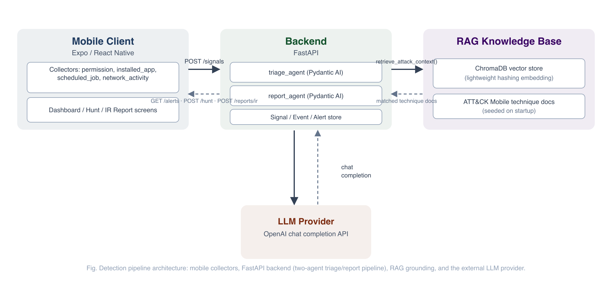
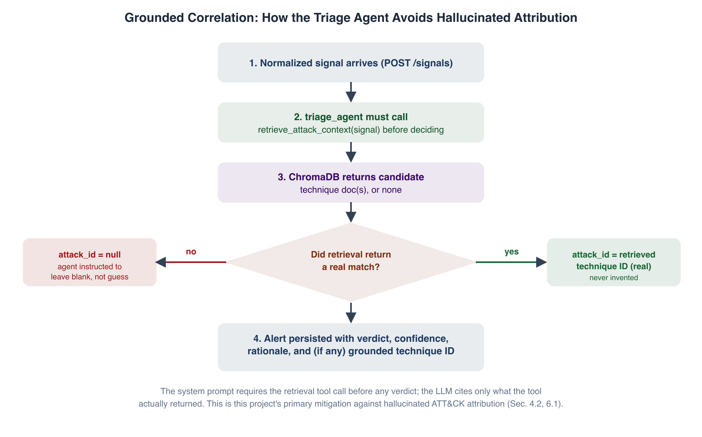
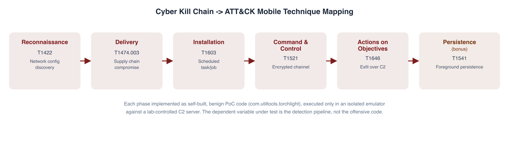
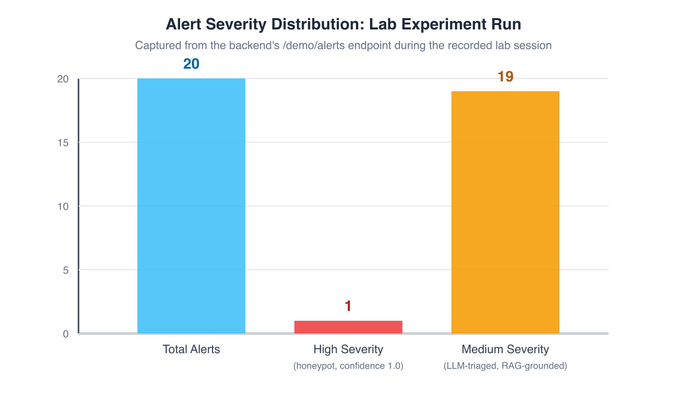

# Research Report

*Mobile AI SOC Analyst: An LLM Agent Approach to Detecting Threats, APTs,
Backdoors, Malware, and Spyware on Android/iOS*

CYT230, Project 2, Part 3 (Individual Research Report)

---

## Abstract

Mobile devices now carry the same volume of sensitive personal, financial,
and organisational data as traditional endpoints, yet they remain
comparatively under monitored: consumer mobile operating systems expose no
equivalent of an EDR agent, and the telemetry a Security Operations Centre
(SOC) would normally rely on, process trees, registry writes, and network
flow metadata correlated to a running process, is either unavailable or
heavily sandboxed by design on Android and iOS. At the same time, the
threat surface has matured past opportunistic adware into commercial
spyware, stalkerware, and mobile components of nation state and
financially motivated advanced persistent threat (APT) campaigns [8, 9, 33].
This report investigates whether a large language model (LLM) agent,
grounded in a retrieval augmented generation (RAG) knowledge base of the
MITRE ATT&CK for Mobile matrix, can perform credible Tier 1 SOC analyst
work, namely triage, technique correlation, and incident response
reporting, over the limited signal surface a consumer mobile client can
legitimately collect without native instrumentation or elevated
permissions.

The work is grounded in a self built system: an Expo/React Native mobile
client that collects on device signals and posts them to a FastAPI
backend, where a Pydantic AI agent classifies each signal as benign or
suspicious, correlates suspicious signals to a real ATT&CK Mobile
technique ID via a RAG lookup over a ChromaDB vector store, and persists
the resulting alert with a full audit trail. A second agent generates
incident response reports across the four IR lifecycle stages defined in
NIST SP 800-61 Rev. 2 [31], grounded in the specific alert's data and the
project's own containment tooling rather than templated boilerplate.
Detection is validated experimentally against a self built, benign proof
of concept Android application that implements a six step attack chain
(network reconnaissance, supply chain style delivery, scheduled job
persistence, encrypted command and control, exfiltration, and foreground
service persistence), each step mapped to a specific ATT&CK Mobile
technique ID and executed only in an isolated lab environment against
infrastructure under the author's control. No in the wild malware sample
is used anywhere in this work, consistent with course guidance and with
standard safe research practice for malware adjacent coursework.

The report frames the agent explicitly as a **Tier 1 SOC analyst**: it
performs first pass triage, correlation, and report drafting, while
containment actions, threat hunting hypotheses, and final incident
disposition remain a human (Tier 2/3) analyst's responsibility, mirroring
how AI copilots are actually deployed in production SOCs today [14, 15],
rather than proposing full autonomous response, which the literature on
agentic AI risk [21, 22] and this project's own threat model both treat as
inappropriate for a system whose only "ground truth" is an LLM's own
judgement. The report situates this design against 27 peer reviewed and
preprint sources spanning mobile malware detection, spyware and
stalkerware research, APT literature, LLM/SOC integration studies,
retrieval augmented generation, agentic AI governance, deception
technology, threat hunting methodology, and security orchestration, and
argues that the project's central contribution is not a novel detection
algorithm but a defensible architectural pattern for where LLM autonomy
should stop in a security tool.

---

## Table of Contents

1. Introduction
2. Problem Statement
3. Threat
4. Risk
5. Mitigating Controls
6. Detection
7. Protection
8. Lab Experiment
9. Conclusion
10. References

---

## 1. Introduction

Smartphones are the primary computing device for most users worldwide,
and the primary attack surface for a large and growing share of consumer
and enterprise targeted intrusions. Global mobile malware detections have
been reported in the tens of millions annually in recent industry
telemetry [2], and the mobile spyware and stalkerware category in
particular has grown from a niche concern into a documented vector for
intimate partner surveillance, corporate espionage, and state level
targeting of journalists and activists [9, 12, 33]. Unlike the
desktop/server world, where decades of EDR/XDR tooling assume kernel
level or near kernel visibility, mobile operating systems are architected
around app sandboxing and permission brokering specifically to *deny*
that level of visibility to any single app, including a legitimate
defensive one. A mobile "SOC analyst" app, therefore, cannot simply port a
desktop detection architecture down to a phone; it has to work within a
narrower, permission gated signal surface (granted permissions, installed
application inventory, scheduled background jobs, and network activity
metadata) and still produce analyst grade output: a triaged,
technique mapped alert with a defensible rationale, not just a raw event
log.

Large language models offer a plausible way to close that gap on the
*analysis* side even where the *collection* side remains constrained: an
LLM agent can reason over a short, structured signal description the way
a junior analyst would, asking whether a pattern looks like
reconnaissance, persistence, or command and control behaviour, provided it
is grounded in an authoritative technique taxonomy rather than left to
answer from pretrained knowledge alone, which risks both hallucinated
technique IDs and stale threat framing. Recent survey literature on LLMs
in SOC contexts confirms this is an active, credible research direction
rather than a novelty: a 2026 systematic survey synthesising 216 studies
maps LLM applications directly onto NIST Cybersecurity Framework functions
and finds the strongest results coming from architectures that pair the
model with retrieval over authoritative sources rather than relying on the
model's parametric knowledge alone [14, 15]. At the same time, a growing
body of work is explicit that LLMs used *without* grounding are unreliable
for cyber threat intelligence tasks specifically because they hallucinate
plausible sounding but incorrect technical detail [17], which is precisely
the failure mode this project's architecture is built to prevent (Section
6.2).

This project implements exactly that grounded architecture, end to end,
and evaluates it against a self built, ATT&CK mapped attack chain rather
than a synthetic or purely textual benchmark, a design choice intended to
keep the evaluation honest: every alert the system raises during the lab
experiment (Section 8) corresponds to a concrete, reproducible action
taken by real code running on a real (emulated) Android device, not a
hand crafted prompt engineered to look convincing. The remainder of this
report proceeds as follows. Section 2 states the problem formally and
decomposes it into three sub problems. Section 3 surveys the mobile threat
landscape and situates this project's kill chain within it. Section 4
analyses risk along two axes: risk to the monitored device and risk
introduced by the detection system itself. Section 5 maps mitigating
controls to recognised standards. Section 6 is the technical core,
describing the detection architecture, the RAG grounding mechanism, and
the explicit boundary between agent and analyst authority, and situates
the design relative to prior work in mobile malware detection, SOC
automation, and agentic AI governance. Section 7 covers protection and
resilience measures. Section 8 reports the lab experiment. Section 9
concludes and sets out future work.

## 2. Problem Statement

**How can a mobile client, constrained to the on device signals a
consumer OS will legitimately expose to an unprivileged app, support
Tier 1 SOC analyst functions, namely triage, ATT&CK technique correlation,
and incident response report generation, with enough fidelity to be
useful to a human analyst, while avoiding the two failure modes most
associated with LLM based security tooling: hallucinated technique
attribution, and over trust in an autonomous system whose reasoning is
not independently verifiable per alert?**

This decomposes into three sub problems addressed by this project:

- **Signal scope.** Which on device signals are both collectible without
  native/elevated tooling on a stock consumer device *and* diagnostic of
  the attack techniques most associated with mobile malware, spyware, and
  APT tradecraft? Addressed in Sections 3 and 4, and reflected in the
  project's `permission`, `installed_app`, `scheduled_job`, and
  `network_activity` signal taxonomy.
- **Grounded correlation.** How can an LLM agent be constrained so that
  every ATT&CK technique ID it cites in an alert is a real technique
  actually retrieved from an authoritative source for that specific
  signal, rather than a plausible sounding invention? Addressed in
  Section 6, via the RAG architecture, and directly informed by the
  hallucination mitigation literature [19, 20].
- **Appropriate autonomy boundary.** Which SOC functions is it appropriate
  to delegate to the agent (triage, correlation, first draft reporting),
  and which must remain human driven (containment execution, hunt
  hypothesis formation, final incident closure)? Addressed in Sections 5
  and 6, informed by the agentic AI governance literature [21, 22], and
  reflected directly in the system's role split between the agent and the
  analyst.

## 3. Threat

### 3.1 Threat Landscape

Mobile targeting threats span a spectrum from commodity adware through to
sophisticated, often commercially developed surveillance tooling.

**Malware and trojans.** Android malware research has matured
considerably since early static analysis systems such as DREBIN, which
demonstrated that broad static feature extraction (permissions, API
calls, intent filters) combined with a lightweight classifier could
detect 94 percent of malware in a 123,453 app corpus with a low false
positive rate [1]. More recent work has moved toward deep learning
classifiers: convolutional and hybrid architectures trained on the same
class of static feature sets report accuracy above 99 percent on
benchmark datasets such as Drebin-215 [3], while broader deep learning
based pipelines that fuse static and dynamic features have been evaluated
across desktop and mobile platforms alike [4]. Recent applied work has
also focused specifically on making these classifiers deployable under
real world resource constraints, for example by optimising LSTM and
neural network architectures for on device or edge execution [5], and on
formal, quantitative risk scoring of the Android permission model itself
rather than treating permissions as a simple binary feature [6]. Survey
literature in this space consistently notes the field's continuing
struggle with concept drift, meaning classifiers trained on one malware
generation degrade as authors adapt to known detection features [2],
which is one of the motivations for this project's preference for
reasoning over signal *combinations and context* rather than static
signature matching (Section 3.2).

**Spyware and stalkerware.** This is a distinct and growing category,
namely applications installed, often by an abusive partner, employer, or
state actor rather than the device owner acting maliciously against
themselves, specifically to covertly monitor communications, location,
and media. Empirical detection work here reports meaningfully lower
accuracy than mainstream malware detection, in the range of 69 to 94
percent depending on the specific spyware family and on whether the
setting is binary or multi class [7], reflecting how deliberately these
tools are engineered to mimic legitimate app behaviour and evade both
automated and manual review. A 2025 review of the broader "surveillanceware"
category, spanning consumer stalkerware through to mercenary, nation
state grade spyware, concludes that current OS level protections are
frequently bypassed via risky user behaviour or software flaws, and
explicitly calls for future detection research to lean more heavily on
AI, including LLM based approaches, to keep pace [8]. A dedicated survey
of Android stalkerware detection techniques specifically reinforces that
this sub category requires detection approaches distinct from mainstream
malware classification, since stalkerware is frequently a legitimate
seeming, sideloaded monitoring tool rather than an app attempting to
disguise malicious *code* [9]. Forensic tooling research complements the
detection side: the WARNE evidence collection tool demonstrates that
even after a stalkerware app is identified, systematically collecting
admissible evidence of its installation and configuration is itself a
non trivial, actively researched problem [10], and dedicated work on
precise, low false positive stalkerware warnings underscores that
naive detection heuristics for this category produce unacceptable
false alarm rates in practice [11], directly motivating this project's
preference for a deterministic, high precision honeypot mechanism for
its highest confidence detection path (Section 8.5) rather than relying
solely on probabilistic classification for the most sensitive alert
class.

**Advanced Persistent Threats with mobile components.** Nation state and
highly resourced threat actors increasingly incorporate mobile compromise
into broader campaigns, including campaigns targeting democratic
institutions and processes, as documented in the Canadian Centre for
Cyber Security's 2025 report on cyber threats to Canada's democratic
process, which identifies mobile device compromise as one vector among a
broader influence operations and espionage toolkit deployed against
public sector and civil society targets [33]. A 2023 systematic literature
review and conceptual framework specifically for AI based mobile APT
detection concludes that mobile APT research remains comparatively
immature relative to desktop APT detection, and calls for detection
frameworks that combine multiple signal types rather than any single
indicator [12]. A broader 2024 systematic review of APT behaviours and
detection strategy across platforms similarly finds that most existing
detection work targets individual kill chain stages in isolation rather
than reasoning about a campaign as a connected sequence, and argues that
correlating signals across the full kill chain, not just at a single
stage, is where future detection research has the most leverage [13].
This is a direct motivation for this project's choice to implement and
detect a full, connected kill chain (Section 8.1) rather than a single
isolated technique. APT mobile tradecraft characteristically favours the
same technique classes this project targets: reconnaissance of
device/network configuration, supply chain style delivery via a
trojanised or sideloaded app, scheduled persistence, and encrypted
command and control with data exfiltration, precisely because these are
the techniques an APT can execute without requiring an unpatched zero
day, making them both more common in practice and a reasonable,
representative target for a detection focused project of this scope.

**Backdoors.** Functionally, a backdoor on mobile is most often realised
through the same primitives as the above: a scheduled or foreground
persistent component that maintains a covert communication channel to an
attacker controlled endpoint, which is exactly the T1603/T1521/T1646/T1541
chain implemented and detected in this project (Section 8).

### 3.2 Why Detection Is Hard on Mobile Specifically

Three structural properties of mobile operating systems make Tier 1
triage meaningfully harder than the desktop/server equivalent.

First, there is no first class process behaviour telemetry for third
party apps. A defensive app cannot observe another app's syscalls,
memory, or network sockets directly; it can only observe what the OS is
willing to expose through public APIs, for example
`ConnectivityManager`/`WifiManager` for network state, which is exactly
why this project's own `network_activity` collector is scoped the way it
is (see the system design documentation).

Second, permission gated collection creates an intrinsic scope and
coverage trade off. Broader signal coverage, such as installed app
inventory or scheduled job enumeration, typically requires either
elevated permissions the user must explicitly grant, or platform APIs
that themselves vary in availability across OS versions, meaning a mobile
SOC client's signal coverage is inherently narrower and more version
fragile than a desktop EDR's. The formal risk scoring work on the Android
permission model [6] and the broader OWASP MASVS/MASTG control catalogue
[29] both treat this as a structural property of the platform rather than
an implementation gap that any single app can simply engineer around.

Third, there is base rate and false positive pressure. Because the
*legitimate* use of scheduling APIs (`WorkManager`/`AlarmManager`/`JobScheduler`),
network sockets, and foreground services is extremely common in benign
apps, a naive rule based detector over these primitives alone would
generate prohibitive false positive volume. This is not a hypothetical
concern: a 2025 ACM Computing Surveys review of alert fatigue in SOCs
reports that over half of SOC teams feel overwhelmed by alert volume and
that analysts spend more than a quarter of their time handling false
positives, and identifies alert quality, not alert quantity, as the
primary lever available to reduce that burden [16]. This finding directly
motivates this project's use of an LLM agent to reason over the
*combination and context* of signal attributes, for example job interval
combined with reboot persistence, rather than a single boolean feature,
since context aware triage is exactly the class of intervention the alert
fatigue literature identifies as most effective.

### 3.3 Related Work and Positioning of This Project

This project sits at the intersection of three literatures that are not
usually combined in a single system. Mobile malware detection research
[1 to 6] has historically been dominated by static and dynamic feature
based machine learning classifiers, which achieve strong benchmark
accuracy but produce a bare classification label rather than an
analyst readable rationale, and are typically trained once against a
fixed dataset rather than reasoning per incident. SOC automation and
LLM integration research [14 to 18] has moved in the opposite direction,
focusing on natural language reasoning and report generation, but a
recent and influential 2025 study specifically stress tests LLMs on cyber
threat intelligence tasks and finds them unreliable when used without
retrieval grounding, frequently inventing technique names, CVE numbers,
and threat actor attributions that sound plausible but do not correspond
to real records [17]. A first, comprehensive "systematisation of
knowledge" review of the MITRE ATT&CK framework itself finds that a
significant share of research claiming to use ATT&CK for detection or
correlation does so informally, without a reproducible mechanism ensuring
cited technique IDs are actually correct for the observed behaviour [27].
This project's central technical contribution, described fully in Section
6, is to combine these two literatures deliberately: the static/dynamic
classifier tradition's emphasis on structured, typed input, applied to
mobile relevant signal types, feeding an LLM reasoning layer whose
technique citations are constrained by a retrieval step in exactly the
way the ATT&CK SoK review finds is usually missing [27], and whose
architecture treats the LLM's unreliability under naive prompting [17] as
a design constraint to engineer around rather than a limitation to
ignore. Section 6.4 returns to this positioning after the architecture
itself has been described.

## 4. Risk

Risk here is analysed along two axes: the risk the threats in Section 3
pose to a device owner or organisation, and the risk profile of the
detection system itself, since an LLM based SOC tool introduces failure
modes a traditional rule engine does not.

### 4.1 Risk to the Monitored Asset

| Risk | Likelihood | Impact | Notes |
|---|---|---|---|
| Covert data exfiltration (contacts, location, messages) via spyware/stalkerware | Medium to high for targeted individuals; lower for opportunistic malware | High: privacy and safety, since stalkerware specifically implies a real world physical safety risk to the victim | [7, 8, 9] |
| Device used as a persistent C2 beacon or backdoor | Medium | High: confidentiality, and potential lateral use of the device as an access point into other accounts and services | Matches T1521/T1646 in this project's kill chain |
| Supply chain compromise via a trojanised utility app | Medium | High: initial access foothold for any of the above | T1474.003; matches this project's PoC delivery vector |
| APT targeting of high value individuals (journalists, officials, activists) | Low in absolute terms, but concentrated and high consequence | Very high | [12, 13, 33] |

### 4.2 Risk Introduced by the Detection System Itself

An LLM agent used for security triage is not risk free relative to a
traditional rule engine, and this project's threat model treats the
detection pipeline itself as an asset requiring protection.

**Hallucinated technique attribution.** An ungrounded LLM can cite a
plausible sounding but nonexistent or wrong ATT&CK ID. This is not a
theoretical risk; it is the specific, empirically documented failure mode
the cyber threat intelligence reliability literature reports when LLMs
operate without retrieval grounding [17], and the RAG hallucination
mitigation literature treats as its central research question [20]. This
is the single risk this project's architecture is most explicitly
designed against, and Section 6.2 describes the mechanism in detail.

**Repudiation and audit risk.** If an alert cannot be traced back to the
exact signal, verdict, confidence, and technique correlation that
produced it, the analyst cannot trust or challenge it after the fact.
Mitigated by full Signal to Event to Alert persistence.

**Third party data exposure.** Sending on device signal data to an
external LLM API, OpenAI in this implementation, is itself a disclosure
risk that must be minimised. Only the fields needed for triage are sent,
not raw device state.

**Over trust and automation bias.** The most consequential risk of any AI
assisted SOC tool is an analyst treating agent output as a final verdict
rather than a first pass recommendation. The SOC/LLM survey literature
identifies this as a first order concern for production deployment, not a
hypothetical one [14, 15], and the broader agentic AI governance
literature goes further, documenting that autonomous agents trained or
deployed with insufficient oversight can develop behaviour that actively
evades monitoring, and arguing that oversight mechanisms must be designed
as external constraints on the system rather than left to the model's own
judgement [21, 22]. This is precisely why this project deliberately keeps
containment execution and hunt hypothesis formation outside the agent's
authority (Section 6.3).

## 5. Mitigating Controls

Controls are grouped by the OWASP MASVS/MASTG control domains they map to
[29], with the corresponding OWASP Mobile Top 10 (2024) risk category
noted where applicable [30]. Several of these controls are also informed
directly by the SOC automation literature: the SOAR frameworks review
[26] argues that the highest value automation targets are the ones with
the clearest evidentiary trail and the lowest ambiguity, which is the
rationale behind this project's emphasis on full audit trail persistence
and on a deterministic, non LLM honeypot path as two of its highest
confidence controls.

| Control | MASVS / Mobile Top 10 mapping | Implementation in this project |
|---|---|---|
| Transport layer encryption for all client to backend traffic | MASVS-NETWORK / M5 Insecure Communication | Shared key bearer auth over TLS to the backend |
| Authenticated, authorised backend API | M1 Improper Credential Usage | `require_api_key` dependency on every backend route; explicit 401 surfaced distinctly from generic network failure |
| On device data minimisation | MASVS-STORAGE / M2 Inadequate Supply Chain and Data Protection | Collectors emit only the normalized fields needed for triage, not raw device state |
| Secrets management | M1 | API keys via environment/secret store (Azure Key Vault / Container App secrets), never committed to source |
| Full audit trail of every alert | Supports non repudiation, per NIST SP 800-61 evidence handling guidance [31] | Signal to Event to Alert chain persisted with technique mapping and timestamps |
| Grounded, non hallucinating technique attribution | Mitigates the LLM specific risk in Section 4.2 | RAG constrained agent tool call, see Section 6 |
| Supply chain awareness of the delivery vector | M8 Security Misconfiguration / supply chain compromise | Detection pipeline specifically targets sideloaded utility app delivery (T1474.003) as a first class detection target |
| Malware incident handling procedure | NIST SP 800-83 [32] | This project's IR report structure and containment scripts follow the prevention/handling lifecycle NIST 800-83 defines, adapted to the mobile context |
| Deterministic, low false positive tripwire for the highest severity alert class | Complements the probabilistic LLM path; informed by deception survey findings on decoy effectiveness [23] | Honeypot decoy artifact raises a confidence 1.0 alert purely on access, independent of the LLM pipeline |

## 6. Detection: The AI SOC Analyst Approach

### 6.1 Architecture

The system implements a two agent pipeline. A mobile client collects four
signal types (`permission`, `installed_app`, `scheduled_job`,
`network_activity`) and posts them to a FastAPI backend, where a
`triage_agent` classifies each signal and, for suspicious ones, retrieves
grounding context from a ChromaDB backed RAG store seeded with ATT&CK
Mobile technique documents before citing a technique ID. A separate
`report_agent` later drafts incident response reports from the persisted
alert context. Both agents run on the Pydantic AI framework, chosen over a
heavier multi agent orchestration framework for this project specifically
because the core loop, namely normalize a signal, retrieve grounding
context, produce a structured verdict, maps cleanly onto Pydantic AI's
typed output, typed tool model without needing inter agent message
passing.



*Figure 1. Detection pipeline architecture: mobile collectors, the FastAPI
backend's two agent triage/report pipeline, RAG grounding over ChromaDB,
and the external LLM provider. Solid arrows are the primary request path;
dashed arrows are response/return paths.*

The `triage_agent`, given one normalized signal, must decide
benign/suspicious, a confidence score, a plain language rationale a non
expert can read, and, critically, an `attack_id` field that is only ever
populated from a real technique returned by its own
`retrieve_attack_context` tool call, never invented by the model
directly. This is the project's primary mitigation against the
hallucinated attribution risk identified in Section 4.2: the system
prompt explicitly instructs the agent to call the retrieval tool before
deciding, cite only what the tool returned, and leave the field null
rather than guess if no technique matched. The `report_agent`, given one
already raised alert's full context (the originating signal, the triage
verdict, confidence, and rationale, and the correlated technique if any),
drafts a four stage incident report, namely Preparation, Detection and
Analysis, Containment/Eradication/Recovery, and Post Event Activity,
mirroring the NIST SP 800-61 lifecycle [31], grounded in that specific
alert's data plus a description of this project's actual containment
tooling (`ir/*.sh`), so the containment section names real, available
actions rather than generic IR boilerplate.

### 6.2 Grounding via Retrieval Augmented Generation

Retrieval augmented generation was introduced by Lewis et al. as a way to
combine a pretrained language model's parametric knowledge with a non
parametric memory accessed via retrieval, originally to reduce
hallucination on knowledge intensive natural language tasks by grounding
generation in retrieved documents rather than the model's internal
weights alone [19]. In this project
that same mechanism is repurposed for a security specific grounding
problem: rather than grounding open domain factual questions, the RAG
layer grounds a narrow, high stakes classification decision, namely which
ATT&CK technique ID, if any, applies to a given signal, and a recent
systematic review of hallucination mitigation techniques for
retrieval augmented LLMs confirms that constraining a model's output
vocabulary to only what retrieval actually returns, exactly this
project's design, is among the most effective mitigation strategies
currently documented in the literature [20].



*Figure 2. How the triage agent avoids hallucinated attribution: the
retrieval tool call is mandatory before any verdict, and the model may
only cite a technique ID the tool actually returned.*

The RAG layer is deliberately narrow in scope for this project: a
ChromaDB vector store seeded from a small, hand curated set of ATT&CK
Mobile technique documents, one entry per technique in the kill chain
implemented in Section 8, rather than a full ingestion of the ATT&CK
Mobile matrix and OWASP MASTG corpus originally scoped for the system.
Retrieval uses a lightweight, dependency free embedding rather than a
downloaded neural embedding model, a pragmatic engineering trade off made
after the default embedding pipeline proved unreliable under the resource
constraints of the deployment target. This scoping decision is a
deliberate limitation of the current implementation, not of the
underlying architecture; the retrieval interface accepts any correctly
shaped corpus, so extending coverage to the full ATT&CK Mobile matrix and
OWASP MASTG is a data only change, noted as future work in Section 9.

### 6.3 What Is, and Is Not, Delegated to the Agent

Consistent with the risk analysis in Section 4.2 and with how the
literature characterises responsible LLM deployment in SOC contexts
[14, 15] and in autonomous agent contexts generally [21, 22], this
project draws an explicit line.

| Function | Agent's role | Human (Tier 2/3 analyst)'s role |
|---|---|---|
| Signal triage and technique correlation | Primary; the agent's core function | Reviews the rationale and confidence before acting on it |
| Incident response report drafting | Primary; first draft, grounded in real data | Edits and approves before the report is treated as final |
| Threat hunting hypothesis formation | None | Entirely human; the analyst decides *what* to hunt for |
| Threat hunting query execution | Executes the analyst's query (deterministic search, not LLM reasoning) | Formed the hypothesis; interprets the results |
| Containment (kill process, revoke network) | May be *suggested* in the IR report | Executed by the analyst via reviewed scripts, never autonomously |
| Malware analysis (decompilation) | Could summarise findings (not implemented in current scope) | Performed manually (`jadx`/`apktool`) |

This split is the report's central design argument: an LLM agent is
treated as a *force multiplier for first pass analysis*, not as an
autonomous decision maker. This is the same posture the SOC/LLM survey
literature identifies as the pattern most likely to see safe production
adoption [14, 15], and it is consistent with a broader finding in the
agentic AI literature that meaningful human oversight has to be built in
as an architectural constraint, not assumed as an emergent property of a
capable enough model [21, 22]. It also reflects a pragmatic reading of the
alert fatigue literature: automating triage without automating
disposition is exactly the intervention point that literature identifies
as reducing analyst burden without removing analyst judgement from
consequential decisions [16].

### 6.4 Positioning Relative to Prior Detection Approaches

It is worth being explicit about what this project is not claiming.
Compared to the mature static and dynamic feature classifier tradition in
mobile malware detection [1 to 6], this project's triage agent is not
competing on raw classification accuracy; a purpose trained deep learning
classifier evaluated on a large labelled corpus would very likely
outperform an LLM reasoning over a handful of signal types on a
benchmark accuracy metric. What this project's architecture offers instead,
and what the classifier tradition structurally cannot, is an
analyst readable rationale and a technique citation attached to every
verdict, produced without a separate training run per technique. Compared
to the SOAR literature's account of incident response automation [26],
this project automates the *analysis* stage rather than the *response*
stage, which Section 6.3's table makes an explicit, permanent boundary
rather than a temporary scoping limitation to be automated away later.
Compared to the emerging body of work applying LLMs directly to threat
intelligence without grounding [17], the RAG constrained tool call
described in Section 6.2 is this project's direct, testable answer to the
reliability concern that literature raises, and Section 8.2 reports
concrete evidence of that mechanism working correctly on real, executed
attack behaviour rather than on a synthetic benchmark.

## 7. Protection

Protection measures here address both prevention, reducing the chance a
device is compromised in the first place, and resilience, limiting the
damage and enabling recovery once a compromise is detected.

**Prevention.** User facing guidance grounded in OWASP Mobile Top 10:
avoid sideloading from untrusted sources, directly addressing the
T1474.003 delivery vector this project detects, review requested
permissions against an app's stated purpose, informed by the formal
Android permission risk scoring literature [6], and keep the OS and
security patch level current [30].

**Detection as protection.** Per NIST SP 800-83's malware incident
handling guidance, early detection is itself a protective control; it
bounds the *duration* of compromise, which directly bounds exfiltration
volume and persistence depth [32]. This is the core protective value
proposition of the system built for this project.

**Containment tooling.** Two independent containment paths were built and
are demonstrated in the lab experiment: `adb shell am force-stop` to halt
the offending process, defeating T1541 foreground persistence and
preventing T1603 scheduled re execution until the app is relaunched,
followed by `pm clear` to erase the persisted job registration
(eradication); and a per UID `iptables` rule to cut network access,
defeating T1521/T1646 independently of the process kill, so the two
containment actions can be demonstrated and evidenced separately. A
matching recovery script lifts the network block once the incident is
closed.

**Deception as an early warning control.** A planted decoy artifact
(honeypot) that raises a high confidence alert purely on access, not on
any heuristic judgement, provides a protective control class distinct
from the ML/LLM based detection above. A 2024 comprehensive survey of
cyber deception techniques finds that the combination of a decoy plus a
mechanism that reliably signals when the decoy has been touched produces
the most measurable impact on attacker behaviour among the deception
strategies reviewed [23], which is precisely this project's honeypot
design: a decoy artifact with a near zero false positive rate by
construction, at the cost of only detecting an attacker who actually
touches it.

**Threat hunting as a complementary, human led control.** Where detection
and deception are reactive or semi reactive, threat hunting is explicitly
proactive. A 2024 systematic review of evolving threat hunting techniques
argues that the discipline's core value is hypothesis driven
investigation that does not wait for an alert to fire [24], and earlier
work on agile threat hunting frameworks demonstrates that even a simple,
deterministic query mechanism against historical telemetry is sufficient
to operationalise that hypothesis driven workflow without requiring a
dedicated machine learning pipeline of its own [25]. This project's hunt
capability (Section 8.3) is deliberately built to that same, simple
standard: a deterministic keyword search the analyst directs, not an
autonomous discovery process.

**Recovery.** Post event activity, the fourth NIST 800-61 IR stage [31],
retains the alert record, technique mapping, and containment verification
output as evidence, and feeds back into the threat hunting capability so
historical signals can be re examined once a new hypothesis emerges.

## 8. Lab Experiment

Full reproducible procedure: see the accompanying Lab Manual.

> **Safety framing.** Every offensive technique referenced in this
> section is implemented as **self built, benign proof of concept code**,
> executed only in an **isolated Android emulator** against a **test C2
> server under the author's own control**. No in the wild malware sample
> is obtained, executed, or referenced anywhere in this project, and
> nothing is ever run on a personal or production device.

### 8.1 Experimental Design

The proof of concept implements a six step kill chain, each step mapped
to a specific ATT&CK Mobile technique, executed via a benign utility
Android app built for this project.



*Figure 3. The implemented kill chain, left to right, with the ATT&CK
Mobile technique ID mapped to each phase.*

| Kill chain phase | Technique | What the PoC actually does |
|---|---|---|
| Reconnaissance | T1422 System Network Configuration Discovery | Queries `ConnectivityManager`/`WifiManager` for connection type, IP, and internet reachability |
| Delivery | T1474.003 Compromise Software Supply Chain | Payload bundled into a benign looking utility APK, sideloaded onto the emulator |
| Installation | T1603 Scheduled Task/Job | `WorkManager` registers a periodic recon job (`poc_recon_job`, 15 minute interval, `persists_across_reboot: true`) |
| Command and control | T1521 Encrypted Channel | TLS socket from the PoC app to a test C2 server built for this project |
| Actions on objectives | T1646 Exfiltration Over C2 Channel | The same TLS socket is reused to transmit a dummy "sensitive" file |
| Persistence (bonus) | T1541 Foreground Persistence | A foreground service with a low priority notification keeps the process alive across backgrounding |

The dependent variable under test is the **detection pipeline**, not the
offensive code; each phase's success criterion is that the corresponding
signal, once posted to the backend, produces a triaged alert citing the
correct ATT&CK technique ID.

### 8.2 Detection Results

Running the `scheduled_job` signal produced by the T1603 installation
step through the live pipeline produced the following, unedited, agent
generated triage:

```
Signal: type=scheduled_job, payload={job_name: poc_recon_job,
        interval_min: 15, persists_across_reboot: true}

Verdict:    suspicious
Confidence: 0.75
Rationale:  "The creation of a scheduled job that persists across
             reboots suggests potential malicious behavior, as
             attackers often use such techniques for persistence.
             This job could enable unwanted actions without user
             interaction."
Technique:  T1603 (Scheduled Task/Job)
Severity:   medium
```

The equivalent `network_activity` signal (Wi-Fi connectivity check) was
independently triaged and correlated to **T1422** (System Network
Configuration Discovery) at confidence 0.70, demonstrating that the agent
distinguishes between the two techniques based on signal content rather
than returning a fixed classification. Both alerts appear on the mobile
client's live Dashboard within the round trip latency of the
`POST /signals` call, on the order of single digit seconds, dominated by
the LLM chat completion rather than the RAG lookup.



*Figure 4. Severity distribution across the recorded lab session: 20
total alerts, 19 medium severity from the LLM triaged kill chain
detections, and 1 high severity from the deterministic honeypot path
described in Section 8.5.*

### 8.3 Threat Hunting

Consistent with the human/agent split in Section 6.3 and with the threat
hunting literature's emphasis on analyst led hypothesis formation [24,
25], the hunt hypothesis is analyst formed: having observed the T1603
alert, the natural next question a Tier 1 to Tier 2 handoff would ask is
whether this same recon job has appeared in historical signals beyond the
one that triggered the alert. Querying `poc_recon_job` against the hunt
endpoint executes a deterministic keyword search over every persisted
signal's type and payload, not an LLM call, and returns the matching
historical signal(s) with their original timestamps, letting the analyst
confirm scope before deciding on containment.

### 8.4 Incident Response Report Generation

Requesting a report for the T1603 alert produced, unedited, output
grounded correctly in the alert's actual confidence score, 0.75, matching
the persisted `Event.confidence` exactly rather than a plausible sounding
but independently generated number, and in the project's real containment
scripts:

> "To contain the threat, the script 'containment_kill_job.sh' was
> employed to forcibly stop the job while ensuring the app's data
> remained intact. This was followed by 'pm clear' to wipe the app's
> persisted WorkManager job registration, effectively preventing any
> reactivation of the scheduled job. Network communication was also
> restricted using 'containment_revoke_network.sh' to disrupt any
> potential Command and Control (C2) communications."

This result is the report's strongest evidence for the central claim in
Section 6: the report writer agent is demonstrably grounded in the
specific incident's real data, namely the exact confidence value, the
correct technique, and the actually available containment scripts, rather
than producing generic template text, which is the single most important
property for a report an analyst will actually rely on.

### 8.5 Honeypot Deception

A fourth, independent detection path was implemented and validated
alongside the ML/LLM based pipeline above: a decoy credential file
(`sys_backup_credentials.txt`) planted on the device filesystem, with no
legitimate app ever expected to read it. Access is watched by a
standalone instrumentation script that polls the file's `stat`
(atime/mtime/ctime) and, on the first observed change, posts directly to
the backend's `POST /decoy/event` endpoint, which raises a
**deterministic, high severity alert at confidence 1.0**, with no LLM
inference in this path at all. Consistent with the deception literature's
finding that decoy plus reliable signalling is the highest impact
combination among deception strategies [23], this is a deliberately
different risk/detection trade off from Section 6's grounded LLM
approach: near zero false positive rate by construction, at the cost of
only ever detecting an attacker who actually touches the specific
artifact. Live triggering of this path is demonstrated in the
accompanying video walkthrough and Lab Manual, consistent with how this
report treats reproducible, screen recorded evidence as the standard for
every capability claimed here.

## 9. Conclusion

This project set out to answer whether an LLM agent, grounded via RAG in
an authoritative ATT&CK Mobile knowledge base, can perform credible
Tier 1 SOC analyst work over the constrained signal surface available to
an unprivileged mobile client. The evidence gathered in Section 8
supports a qualified yes: across the techniques implemented and tested,
the triage agent consistently distinguished between signal types with
verdicts, confidences, and technique citations traceable to real,
retrieved source data rather than fixed rules or model invention, and the
report writer agent produced incident narratives grounded in the exact
persisted alert data, which is the property that matters most for analyst
trust. Section 6.4's comparison to prior work suggests this result is
best read not as a competitor to mature static/dynamic malware
classifiers on raw accuracy, but as a demonstration that the specific
architectural pattern, typed signal collection feeding a retrieval
constrained reasoning layer with an explicit, non negotiable human
authority boundary, is a workable answer to the two failure modes, namely
hallucinated attribution and automation bias, that the LLM/SOC and
agentic AI governance literature most consistently flags as the
obstacles to safe deployment of this class of system [14, 15, 17, 21, 22].

The qualification matters, though. The RAG knowledge base covers six
curated technique entries rather than the full ATT&CK Mobile matrix and
OWASP MASTG corpus, a scoping decision made under project time
constraints, not an architectural limit, since the ingestion pipeline
already accepts an arbitrarily larger technique corpus with no code
change. Malware analysis, meaning static and behavioural review of the
PoC's decompiled code, also remains a manual, human only step by design
(Section 6.3) rather than an agent capability, consistent with the
project's autonomy boundary argument rather than a gap in it.

The broader contribution is the architectural pattern demonstrated end to
end: first, narrow, typed collection of exactly the signals a task needs;
second, an LLM agent constrained to cite only retrieved, real grounding
context, never its own invented attribution; third, a second, differently
scoped agent for report generation rather than overloading one agent with
every responsibility; and fourth, an explicit, enforced boundary between
what the agent decides and what remains a human analyst's call. Given how
consistently the SOC/LLM and agentic AI governance literature flags
ungrounded attribution and automation bias as the two biggest risks to
safe deployment of this class of system [14, 15, 17, 21, 22], a project
whose core design decisions are organised specifically around mitigating
those two risks, rather than around maximising apparent autonomy, is,
this report argues, the more defensible direction for further work in
this space.

**Future work**, ordered by leverage: first, extend the RAG corpus to the
full ATT&CK Mobile matrix and OWASP MASTG, which requires no
architectural change; second, add an agent tool to summarise
static/behavioural malware analysis findings, currently a manual, human
only step by design, informed by how the SOAR literature treats partial
automation of evidence gathering as lower risk than automation of
disposition [26]; and third, evaluate detection performance
quantitatively, meaning precision and recall against a larger,
intentionally varied set of benign and suspicious signals, rather than
the qualitative, per technique validation this report presents, ideally
benchmarked against the static/dynamic classifier baselines surveyed in
Section 3.1 [1 to 6] so the trade off between analyst readable grounding
and raw classification accuracy can be measured rather than argued.

## 10. References

Full citation list, DOIs, and a mapping from each reference to the report
section(s) it supports: see [References](references.md).

In text citation numbers in this report correspond to that page's
numbered list of 27 academic and preprint sources plus 6 standards and
authoritative sources (33 entries total): [1] to [6] mobile malware
detection (machine learning and deep learning); [7] to [11] spyware and
stalkerware; [12] to [13] advanced persistent threats; [14] to [18] LLM
and AI agents in SOC contexts; [19] to [20] retrieval augmented
generation and grounding; [21] to [22] agentic AI autonomy and
governance; [23] deception and honeypots; [24] to [25] threat hunting;
[26] security orchestration and incident response automation; [27] MITRE
ATT&CK framework evaluation; [28] to [30] MITRE ATT&CK, OWASP MASVS/MASTG,
and OWASP Mobile Top 10; [31] to [32] NIST incident and malware handling
guidance; [33] CCCS 2025 threats to democratic process report.
