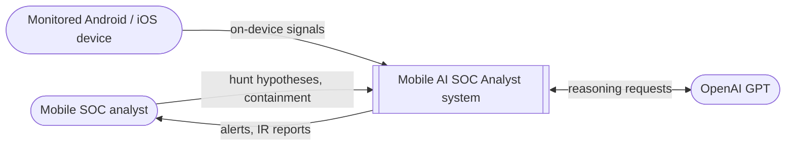
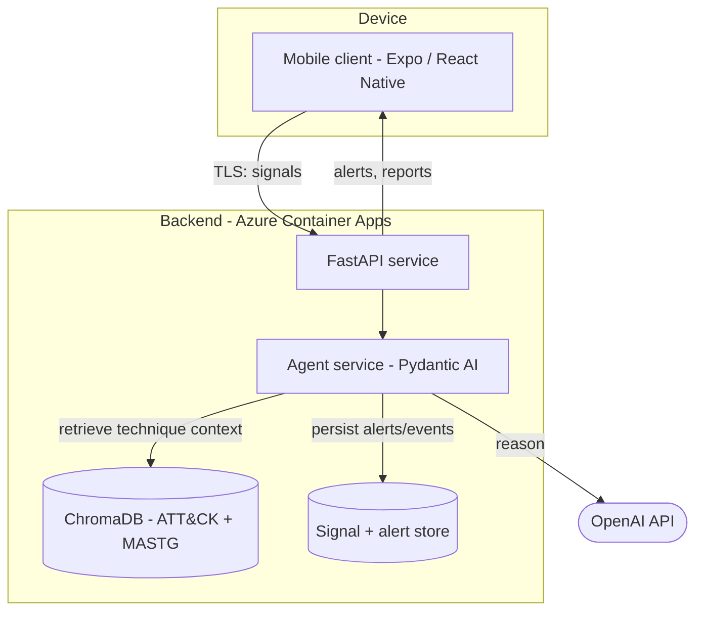
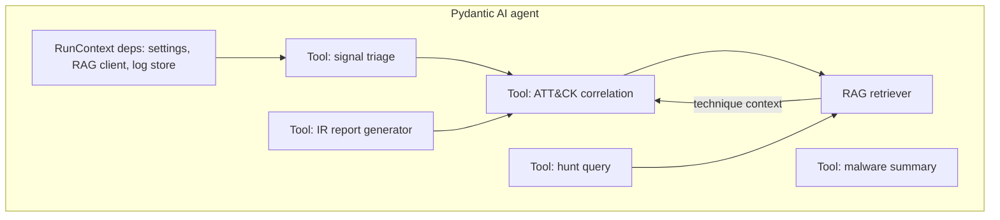

# Architecture

C4-style view of the system: context, containers, and the agent's internal components. Technology choices are in [Tech Stack](tech-stack.md); runtime flows in [System Design](system-design.md).

## What the agent is
The agent is a **Tier-1 SOC analyst**: triage, correlation against ATT&CK techniques, and initial IR report generation. It augments a human analyst — it is not the whole defense.

| Requirement | Agent's role | Human (analyst) role |
|---|---|---|
| Detection & Analysis | Core agent function | Review, escalate |
| Incident Response | Report generation, suggested containment | Execute containment |
| Threat Hunting | Runs the hunt query | Forms the hypothesis |
| Malware Analysis | Summarises findings | Manual decompile (jadx/apktool) |
| Deception (honeypot) | Alerts when decoy is touched | Plants the decoy |

## Context diagram

## Container diagram

## Agent component diagram

The mobile client collects signals (FR-001) and renders the dashboard (FR-006); the agent performs triage/correlation (FR-002, FR-003), hunting (FR-005), malware summary (FR-008), and IR reporting (FR-004), persisting every alert for audit (FR-009).
