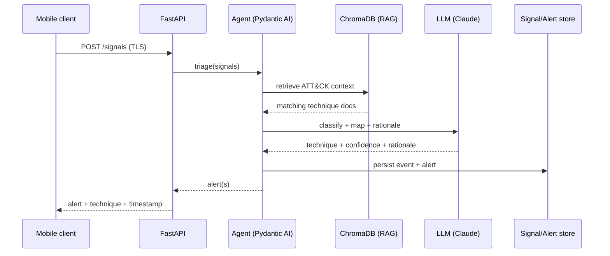
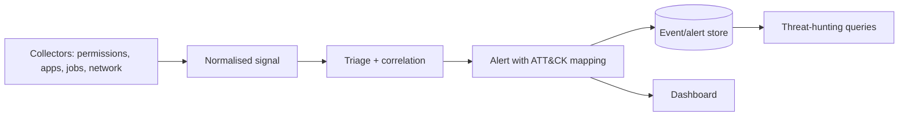
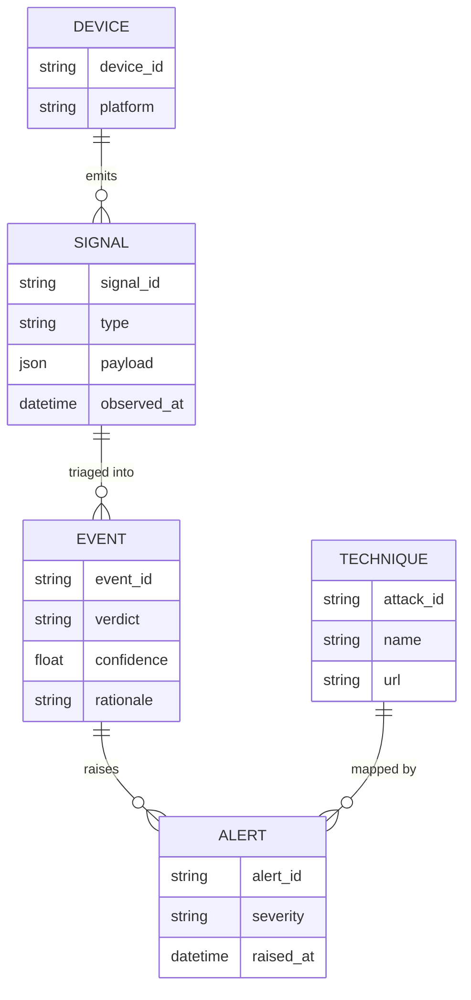
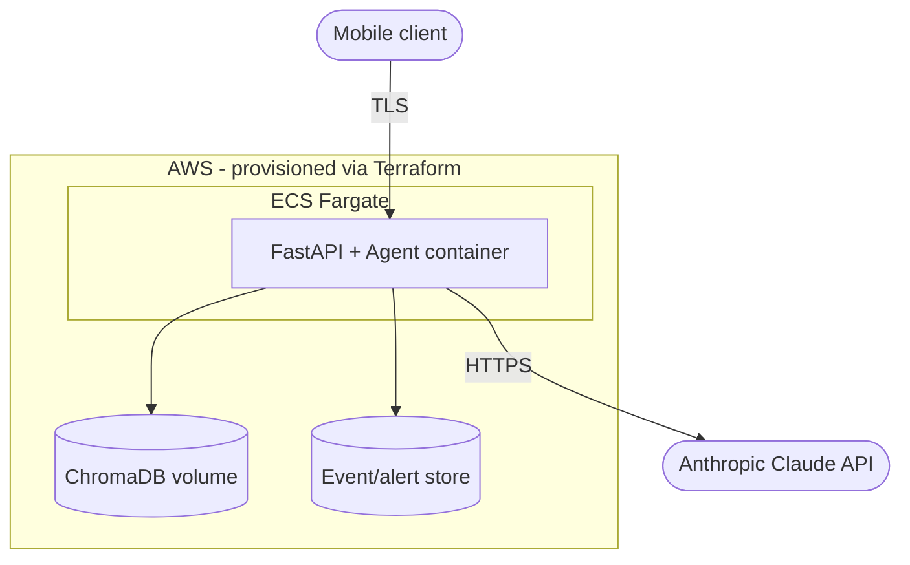

# System design

Runtime design: the detection path, data flow, data model, API surface, RAG pipeline, and deployment. See [Architecture](architecture.md) for the static structure.

## Detection sequence

## Data flow

## Alert / event data model

## API surface (sketch)
| Method | Path | Purpose | Requirement |
|---|---|---|---|
| POST | `/signals` | Ingest a batch of on-device signals | FR-001 |
| GET | `/alerts` | List alerts for the dashboard | FR-006 |
| POST | `/hunt` | Run an analyst hunt query over history | FR-005 |
| POST | `/reports/ir` | Generate an IR report for an incident | FR-004 |
| POST | `/decoy/event` | Report honeypot access | FR-007 |

All endpoints require authentication (NFR-004) over TLS (NFR-003).

## RAG pipeline
1. **Ingest** the ATT&CK Mobile matrix + OWASP MASTG into ChromaDB (chunk + embed).
2. **Retrieve** technique context for a normalised signal at triage time.
3. **Ground** the LLM classification in the retrieved technique docs so mappings cite a real ATT&CK ID.

## Deployment

