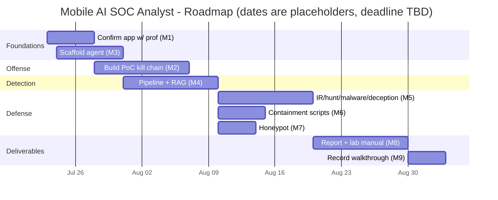

# Action plan

Sequencing driven by the gated grading: Part 3 (research + lab) unlocks Part 2 (attack & defense), which unlocks Part 1 (the app). Priorities are in [MoSCoW](../product/moscow.md).

> Submission deadline(s) are **TBD** — the Gantt below uses placeholder dates from the project start (2026-07-23). Replace with the real deadline and the milestones will re-flow.

## Milestones
| # | Milestone | Maps to |
|---|---|---|
| M1 | Confirm app specifics with professor | Part 1 gate |
| M2 | Build the PoC kill chain (scheduled job → encrypted C2 → exfil) | Part 2 offense |
| M3 | Scaffold the Pydantic AI agent (tools, `RunContext` deps, ATT&CK schema) | Detection core |
| M4 | Detection pipeline + RAG correlation working end-to-end | FR-002, FR-003 |
| M5 | Defense set: IR, threat hunting, malware analysis, deception | Part 2 defense |
| M6 | Containment scripts (kill scheduled job, revoke network) | IR demo |
| M7 | Honeypot / decoy artifact + tripwire alert | FR-007 |
| M8 | Research report (10–15 pp) + lab manual | Part 3 |
| M9 | Record video walkthrough (OBS) | Part 3 |

## Roadmap

## Open items checklist
- [ ] Confirm app specifics with prof (M1)
- [ ] Draft PoC code: scheduled-task → encrypted C2 → exfiltration
- [ ] Scaffold Pydantic AI agent (tools, `RunContext` deps, ATT&CK mapping schema)
- [ ] Build containment scripts (kill scheduled job, revoke network access)
- [ ] Set up honeypot / decoy artifact
- [ ] Draft narration script / OBS scene layout for the video
- [ ] Fill real submission deadline into this Gantt
