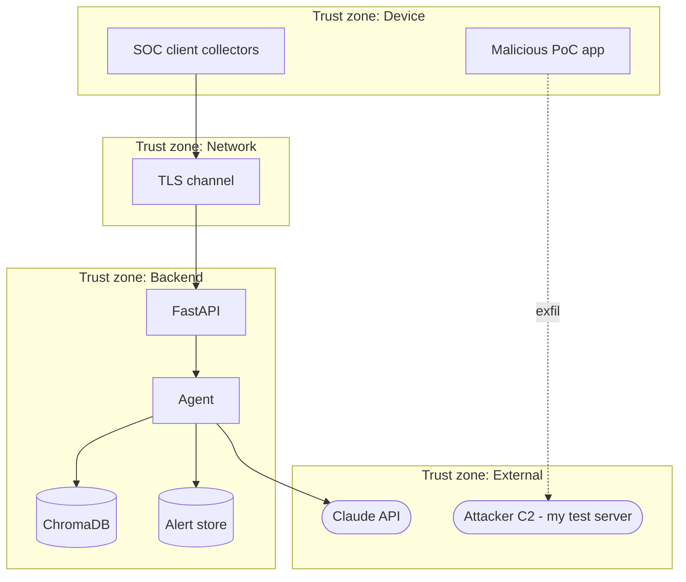
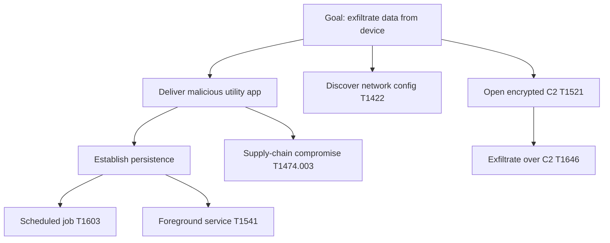

# Threat model

STRIDE decomposition mapped to the ATT&CK Mobile kill-chain the PoC implements and to OWASP Mobile Top 10 / MASVS controls. Controls live in the [Security Model](security-model.md).

> Safety framing: the offensive chain below is a **self-built benign proof-of-concept**, executed only in an **isolated lab** against infrastructure **under my control** — **never** on a personal device, no in-the-wild malware.

## Scope & assumptions
- **In scope:** monitored device + mobile client, network path, backend (API/agent/RAG/store), LLM dependency.
- **Assumptions:** lab is isolated; the attacker is a malicious app the user installs (the PoC utility APK); the backend and analyst are trusted.

## Assets
On-device signals, alert/technique-mapping integrity, IR reports, LLM/API credentials, the analyst's trust in alert fidelity.

## Data-flow diagram with trust boundaries

## STRIDE per element
| Element | Threat (STRIDE) | Mitigation / detection |
|---|---|---|
| Mobile client → API | **Tampering / Info disclosure** of signals in transit | TLS (NFR-003); reject plaintext |
| API | **Spoofing** unauthenticated clients | Client auth (NFR-004) |
| Agent triage | **Repudiation** of what fired an alert | Full audit log (FR-009) |
| Malicious PoC app | **Elevation / Info disclosure** via scheduled C2 + exfil | Detection pipeline maps to ATT&CK, raises alert |
| LLM dependency | **Info disclosure** of signal data to third party | Data minimisation (NFR-005); send only needed context |
| Honeypot artifact | **Info disclosure** attempt on decoy | High-confidence tripwire alert (FR-007) |
| Alert store | **Tampering** with historical evidence | Integrity + access control |

## Attack tree (primary abuse path)

## What is being tested
The system-under-test is the **detection pipeline**. The PoC executes this chain and each step must produce the expected alert (see [Test Strategy](../testing/test-strategy.md) detection matrix):

| Kill-chain step | ATT&CK technique | OWASP Mobile / MASVS focus | Detection that must fire |
|---|---|---|---|
| Reconnaissance | [T1422](https://attack.mitre.org/techniques/T1422/) | M8 Security Misconfiguration / MASVS-PLATFORM | Alert on network-config discovery API use |
| Delivery | [T1474.003](https://attack.mitre.org/techniques/T1474/003/) | M1 Improper Credential Usage / supply chain | Alert on sideloaded utility with payload |
| Installation | [T1603](https://attack.mitre.org/techniques/T1603/) | M4 Insufficient I/O Validation / MASVS-CODE | Alert on suspicious scheduled job |
| Command & Control | [T1521](https://attack.mitre.org/techniques/T1521/) | M5 Insecure Communication / MASVS-NETWORK | Alert on unexpected encrypted channel |
| Actions on objectives | [T1646](https://attack.mitre.org/techniques/T1646/) | M2 Inadequate Supply Chain / MASVS-STORAGE | Alert on exfil over C2 |
| Persistence (bonus) | [T1541](https://attack.mitre.org/techniques/T1541/) | M8 Security Misconfiguration | Alert on foreground-service abuse |

## Residual / untested risks
iOS-specific vectors (Android tested first), LLM prompt-injection via crafted signal content, and supply-chain compromise of third-party dependencies — noted for future work, not covered by the current PoC.
